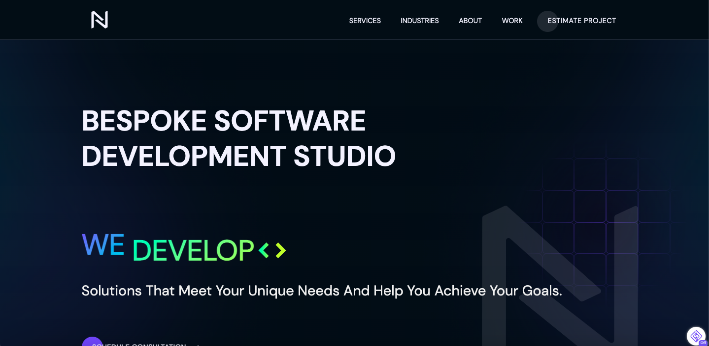

<br />
<p align="center">
  <a href="https://nurdsoft.co">
    
  </a>
</p>
<br />


<p>
This web app is created using Gatsby, ReactJS, Typescript and Sass.
</p>
<br />


 

<br />

## 🚀 Usage

1.  **Start developing.**

    git clone the project and navigate into directory and start it up.

    ```shell
    git clone git@github.com:nurdsoft/nurdsoft-web.git
    cd nurdsoft-web/
    npm install && npm run develop
    ```

2.  **Open the code and start customizing!**

    Your site is now running at http://localhost:8000!

    Edit `src/pages/index.tsx` to see your site update in real-time!
  
3.  **Build**

    To build the application, use the following command: 

    ```shell
    npm run build
    ```
4.  **Start(Production)**

    To start the application in the production envrionment, use following command: 

    ```shell
    npm run start
    ```
5.  **Contributing**

    To contribute to this project create a new branch from main, with prefix `feature` or `fix` and create a PR.
